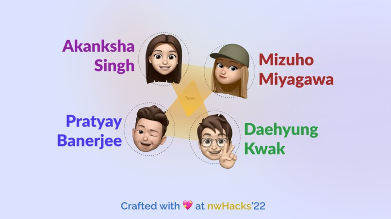

# MyLife@2022 :woman_technologist:
I'll be logging major events/milestones of my tech journey and career every year so that I can look back at my accomplishments/failures and things I learned later sometime in life.

## Jan 7-9
- Participated in SheHacks+, Canada's Largest All-Female and Non-Binary Student Hackathon and build [Eye Assist](https://devpost.com/software/eye-assist)
- Won Architech: Build A Better Future Award (First hackathon win of 2022 :star_struck:)
- Architech also posted about this on [LinkedIn](https://www.linkedin.com/feed/update/urn:li:activity:6891477616415887360/)

## Jan 10
- First day of internship at JP Morgan Chase & Co. 

## Jan 15-16
- Decided to join another hackathon nwPlus this weekend and worked on [HealthQuest](https://devpost.com/software/healthquest) with a very diverse team.  

## Jan 22-23
- This weekend I had some coding assesments and other stuff so I decided to join hackathons alone as I wasn't sure if I'll be able to fully commit to it and didn't wanna burden other team members.
- Worked on [Breathe.ly](https://devpost.com/software/breathe-ly-xrhmz9) and submitted to Hack Cambridge, QWER Hacks and StarHacks II 
- Won MLH: Best use of Google Cloud Prize in StarHacks II and runner up prize in Health & Wellness Track in QWER Hacks. 

## Jan 29-30
- Was sick 🤒 so didn't do anything productive whole week. 
- Joined QHacks by Queen's University virtually and worked on a simple project.

## Feb 1
- Got accepted in "Road to GDE" mentorship program by Google 🤩 
- Excited to upskill myself and learn a lot in next 3 months 👩‍💻

## Feb 5-6
- Kickstarted Ripple 1.0, a 30 day Mentorship Program that I started with 3 of my classmates. We matched mentors from 2022 MCA IGDTUW batch to 2023 batch students and with this mentorship program we aim to build a strong community of MCA IGDTUW students and help our juniors in getting guidance in their placement prep. 
- I participated in HackViolet this weekend with Kaman Au, an excellent designer from Philippines. I converted her designs into code and created Sheroes with her. We won Best use of Google Cloud 2nd place. Though we were confident of our idea and project and believed we had potential to win in other categories as well but I am happy that I got a chance to work with Kaman on Sheroes. 

## Feb 12-13
- Hosted session on Firebase which was part of Road to Google Solution Challenge by GDSC IGDTW.
- Speaker at Intro to Mobile Dev workshop at KurinjiHacks
- No hackathons this weekend. 

## Feb 19-20
- This week was very hectic as I was Hackathon Lead for Shooting Stars Foundation All Girls Hackathon and had to manage a lot of things this week and on 19-20th.
- Participated in PowerToFly APAC Hackathon and won 1st Place 🤩   
- Was also sick so it was not a pleasant week for me. Taking rest for next few days

   

## Feb 26-27  
- This week was great. I signed my first full time SWE job offer letter and celebrated with family 🥳🎊
- Gave a talk on "Push notifications made easy with OneSignal" at Flutter Festival El Jadida and hosted workshop titled "Flutter 101" at Tech together chicago hackathon.
